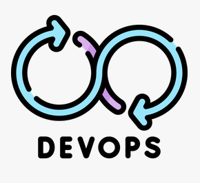

#  Continuous Software Development and Delivery - Lab Base Docker Image
[![CC BY-SA 4.0][cc-by-sa-shield]][cc-by-sa]

## Introduction

This Docker image is supposed to be used as a base for demos and examples available in the [Computer Networks Lab Demo Projects repo "kiv-psi"](https://github.com/maxotta/kiv-psi) and your own projects.

## Image description

The image is based on the [official Ubuntu Docker image](https://hub.docker.com/_/ubuntu) `ubuntu:focal`.
It adds the following packages:
## Using the image

If you want to use this image, just pull it with
```
docker pull ghcr.io/maxotta/kiv-cicd-golang-devcontainer:latest
```

## Building images based on this base

Just use the `FROM <image>` clause to build a new image based on this image. If you want, for example, create a new image that adds the `build-essential` package to the container, do it as follows:

```
FROM ghcr.io/maxotta/kiv-psi-base-docker:latest

RUN apt-get -y install build-essential
```

---

This work is licensed under a
[Creative Commons Attribution-ShareAlike 4.0 International License][cc-by-sa].

[![CC BY-SA 4.0][cc-by-sa-image]][cc-by-sa]

[cc-by-sa]: http://creativecommons.org/licenses/by-sa/4.0/
[cc-by-sa-image]: https://licensebuttons.net/l/by-sa/4.0/88x31.png
[cc-by-sa-shield]: https://img.shields.io/badge/License-CC%20BY--SA%204.0-lightgrey.svg
